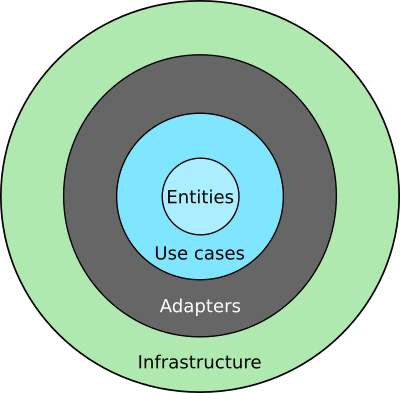

# Pay Calculator
by Wilson Paul Rojas C.

## Overview
The company ACME offers their employees the flexibility to work the hours they want. They will pay for the hours worked based on the day of the week and time of day, according to the following table:


| Monday - Friday | Price |
| ------ | ------ |
| 00:01 - 09:00 | 25 USD |
| 09:01 - 18:00 | 15 USD |
| 18:01 - 00:00 | 20 USD |


| Saturday and Sunday | Price |
| ------ | ------ |
| 00:01 - 09:00 | 30 USD |
| 09:01 - 18:00 | 20 USD |
| 18:01 - 00:00 | 25 USD |

### Input
The name of an employee and the schedule they worked, indicating the time and hours. This should be a .txt file with at least five sets of data. You can include the data from our two examples below.

```txt
RENE=MO10:00-12:00,TU10:00-12:00,TH01:00-03:00,SA14:00-18:00,SU20:00-21:00
```
## Architecture
I used the clean code architecture as correct as possible, ordering the packages and classes in such a way that there is always an order from the outside to the inside, as shown in the image.



## SOLID Principles
SOLID principles such as "The Single Responsibility Principle" and "Open-Closed Principle" were used in all functions.

## Design Patterns
Finally, the "Strategy" design pattern was used to separate the WEEKEND and MIDWEEK classes and develop strategies to calculate prices according to the type of day.
### Main
Based on the SOLID principles the objects have been encapsulated so that the main code has the fewest lines of code and everything is correctly separated and independent to explain better, they separate it into three parts.
```java
  public static void main(String[] args) throws IOException {
        //First
        ParseData parseData= new ParseData();
        Employee employee= parseData.txtToEmployee(INPUT_FILE);
        //Second
        Calculate calculate= new Calculate();
        Double pay= calculate.calcTotalPrice(employee.getTimesWorked());
        //Third
        System.out.println("The amount to pay "+employee.getName()+" is "+pay+" USD.");
    }
```
## Explaining the code
#### First
I convert the text file to an object of type "Employee" and initialize the name and schedule.
```java
ParseData parseData= new ParseData();
Employee employee= parseData.txtToEmployee(INPUT_FILE);
```
I developed this function to read and convert the data.
```java
    public Employee txtToEmployee(String inputPath) throws IOException {

        InputStream inputStream = ParseData.class.getResourceAsStream(inputPath);

        HandlingFiles handlingFiles = new HandlingFiles();
        String line = handlingFiles.readFromInputStream(inputStream);

        String[] lineSeparated = line.split("=");
        String name = lineSeparated[0];
        String timesString = lineSeparated[1];

        String[] hoursWorkedArray = timesString.split(",");
        List<String> hoursWorked = Arrays.asList(hoursWorkedArray);
        Employee employee = new Employee(name, hoursWorked);

        return employee;
    }
```
#### Second
I calculate the total price passing as a parameter a list of "Strings" with the hours worked.
```java
Calculate calculate= new Calculate();
Double pay= calculate.calcTotalPrice(employee.getTimesWorked());
```
The function  ```calculate.calcTotalPrice(employee.getTimesWorked()); ``` is the one that calculates the time worked and its value in dollars.

```java
public Double calcTotalPrice(List<String> hourTimesWorked){

        double totalPay=0.0;
        for (String hourWorkedString: hourTimesWorked) {
            String day= hourWorkedString.substring(0,2);
            String hours= hourWorkedString.substring(2);

            Schedule schedule= calcSchedule(day, hours);
            totalPay= totalPay+schedule.getPay();
        }
    return totalPay;
    }
```
However, the function that performs the classification using the "Strategy" design pattern is:
```java
 public Schedule calcSchedule(String day, String hourWorkedString){

        String shiftReal="";
        Double hoursElapsed=-1.0;
        String typeOfDay= null;
        Double valueHour=-1.0;
        double pay;

        if (Arrays.asList(MIDWEEK_DAYS).contains(day)) {
            typeOfDay="MIDWEEK";
        } else if (Arrays.asList(WEEKEND_DAYS).contains(day)) {
            typeOfDay="WEEKEND";
        }

        //Separation of hours
        String sinceHourString = hourWorkedString.split("-")[0];
        String toHourString = hourWorkedString.split("-")[1];

        LocalTime hourSince = LocalTime.parse(sinceHourString, DateTimeFormatter.ISO_TIME);
        LocalTime hourTo = LocalTime.parse(toHourString, DateTimeFormatter.ISO_TIME);

        for (Shift shift : SHIFTS) {

            String shiftSince = "sc";
            String shiftTo = "st";

            if (hourSince.isAfter(shift.getHourSince()) && hourSince.isBefore(shift.getHourTo())) {
                shiftSince = shift.getShift();
            } else {
                new Exception("No existe hora");
            }
            if (hourTo.isAfter(shift.getHourSince()) && hourSince.isBefore(shift.getHourTo())) {
                shiftTo = shift.getShift();
            }
            if (shiftSince.equals(shiftTo)) {
                shiftReal = shift.getShift();

                Duration timeElapsed = Duration.between(hourSince, hourTo);
                hoursElapsed = Double.valueOf(timeElapsed.getSeconds() / 3600.0);

                /**
                 * PATTERN DESIGN: STRATEGY
                 */

                Day today = null;
                if (typeOfDay.equals("MIDWEEK")) {
                    today = new Midweek();
                } else if (typeOfDay.equals("WEEKEND")) {
                    today = new Weekend();
                }
                valueHour = today.payValue(shiftReal);

            }
        }
        pay = hoursElapsed* valueHour;
        Schedule schedule= new Schedule();
        schedule.setDay(day);
        schedule.setShift(shiftReal);
        schedule.setTypeOfDay(typeOfDay);
        schedule.setHourWorkedString(hourWorkedString);
        schedule.setHoursElapsed(hoursElapsed);
        schedule.setValueHour(valueHour);
        schedule.setPay(pay);
        
        return schedule;
    }
```
#### Third
Finally, I output to the console with the concatenated message so that the user can know how much they have to pay.
```java
 System.out.println("The amount to pay "+employee.getName()+" is "+pay+" USD.");
```
### Output: 
Indicate how much the employee has to be paid
```sh
The amount to pay RENE is 215.0 USD.
```

## Testing

To see the unit tests you can enter this [link](https://github.com/paulrcam12/payCalculator/tree/main/src/test/java/com/paulrcam).


## Features

- Import text files with input data.
- Calculate the working hours of each employee.
- Calculate the payment in dollars of each employee.


## Tech

For this project I use Java 16 and Apache Maven.


## Installation


This aplication requires [Java SE](https://www.oracle.com/java/technologies/java-se-glance.html) V16+ and to run.

Install the dependencies and devDependencies and start the server.

```sh
cd recruitmentExercise
mvn clean install
java -jar target\recruitmentExercise-1.0-SNAPSHOT.jar
```

## Dependencies

This app only has one dependency which is JUnit 4 for unit tests.

| Plugin | README |
| ------ | ------ |
| JUnit 4 | https://junit.org/junit4/ |


